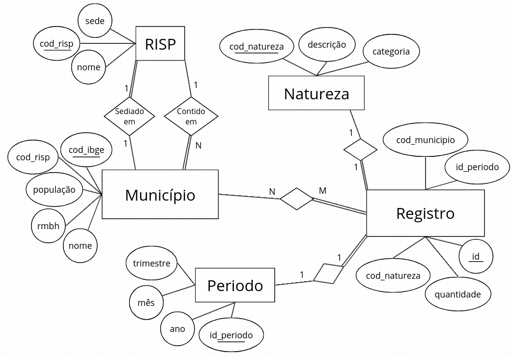

# Crimes Violentos em Minas Gerais — Análise com Banco de Dados Relacional

> Trabalho da disciplina de **Banco de Dados** explorando dados abertos de segurança pública do estado de Minas Gerais. Modela, importa e consulta o dataset oficial de crimes violentos via PostgreSQL.

---

## 📌 Sobre o Projeto

Este repositório contém a modelagem, importação e análise do dataset **Crimes Violentos** publicado pelo Observatório de Segurança Pública (SEJUSP-MG), alimentado pelo sistema **REDS — Registro de Evento de Defesa Social**.

O trabalho está dividido em duas entregas:

| Etapa | Prazo | Conteúdo |
|---|---|---|
| **Versão parcial** | 04/05/2026 | Modelagem ER preliminar + banco **não-normalizado** em PostgreSQL + **5 consultas** em SQL e álgebra relacional |
| **Versão final** | 08/06/2026 | Schema normalizado em 3FN + enriquecimento com dados externos (IBGE) + relatório completo em Jupyter Notebook |

---

## 📊 Dataset

| Atributo | Valor |
|---|---|
| **Fonte** | [Portal de Dados Abertos MG — Crimes Violentos](https://dados.mg.gov.br/dataset/crimes-violentos) |
| **Órgão produtor** | Observatório de Segurança Pública — SEJUSP-MG |
| **Sistema de origem** | REDS (Registro de Evento de Defesa Social) |
| **Cobertura geográfica** | 853 municípios de Minas Gerais |
| **Cobertura temporal** | Janeiro/2025 a Março/2026 (15 meses) |
| **Granularidade** | Município × Natureza do crime × Mês |
| **Formato bruto** | CSV separado por `;`, codificação UTF-8 |

### Estrutura do CSV bruto

| Coluna | Tipo | Descrição |
|---|---|---|
| `registros` | inteiro | Quantidade de crimes registrados na combinação |
| `natureza` | texto | Tipo do crime (ex: `HOMICIDIO CONSUMADO`, `ESTUPRO TENTADO`) |
| `municipio` | texto | Nome do município |
| `cod_municipio` | inteiro | Código IBGE do município |
| `mes` | inteiro | Mês (1–12) |
| `ano` | inteiro | Ano (2025, 2026) |
| `risp` | texto | Região Integrada de Segurança Pública |
| `rmbh` | texto | `SIM` se o município pertence à Região Metropolitana de Belo Horizonte |

### Volume de dados

- **191.925 linhas** na tabela bruta (`853 municípios × 15 naturezas × 15 meses`)
- **31.620 ocorrências** somadas (`SUM(registros)`)
- **11.414 combinações únicas** com pelo menos um crime registrado
- **15 naturezas** distintas
- **19 RISPs** distintas

> 📝 **Observação importante:** o dataset bruto é uma **matriz completa** — para toda combinação de município × natureza × mês existe uma linha, **mesmo quando `registros = 0`**. Essa decisão preserva a informação de que houve coleta (ausência de crime ≠ ausência de dado). Por isso, consultas que perguntam "ocorreu" ou "registrou crime" precisam filtrar `WHERE registros > 0`.

---

## 🗂️ Estrutura do Repositório

```
crimes-violentos-mg/
├── README.md                          # Este arquivo
├── data/
│   └── raw/
│       ├── crimes_violentos_2025.csv  # Dados brutos — ano 2025
│       └── crimes_violentos_2026.csv  # Dados brutos — janeiro a março de 2026
├── sql/
│   ├── 01_criar_tabela_inicial.sql    # CREATE TABLE da tabela bruta crimes_raw
│   ├── 02_consultas_parcial.sql       # Entrega parcial: 5 consultas em SQL
│   ├── 03_schema_normalizado.sql      # Entrega final: schema 3FN (5 tabelas)
│   ├── 04_migrar_dados.sql            # Migração crimes_raw → schema normalizado
│   └── 05_enriquecer_dados.sql        # Classificação das naturezas em categorias
└── docs/
    └── diagramas/
        ├── diagrama_er.jpeg           # Diagrama Entidade-Relacionamento
        └── esquema_relacional.pdf     # Esquema relacional (PKs e FKs)
```

---

## 🧱 Modelagem

### Banco não-normalizado (entrega parcial)

A tabela `crimes_raw` é uma cópia direta da estrutura do CSV. Serve como base para as 5 consultas da versão parcial.

```sql
CREATE TABLE crimes_raw (
    id            SERIAL PRIMARY KEY,
    registros     INTEGER,
    natureza      VARCHAR(100),
    municipio     VARCHAR(100),
    cod_municipio INTEGER,
    mes           INTEGER,
    ano           INTEGER,
    risp          VARCHAR(100),
    rmbh          VARCHAR(10)
);
```

### Schema normalizado em 3FN

O banco foi normalizado em **5 tabelas** (script em [`sql/03_schema_normalizado.sql`](sql/03_schema_normalizado.sql)). A migração dos dados de `crimes_raw` para o schema normalizado está em [`sql/04_migrar_dados.sql`](sql/04_migrar_dados.sql).

| Entidade | Cardinalidade | Papel | Atributos principais |
|---|---|---|---|
| **Município** | 853 | Dimensão | `cod_ibge` (PK), `nome`, `pertence_rmbh`, `populacao`, `cod_risp` (FK) |
| **RISP** | 19 | Dimensão | `cod_risp` (PK), `nome_sede` |
| **Natureza** | 15 | Dimensão | `cod_natureza` (PK), `descricao`, `categoria`, `consumado` (booleano) |
| **Período** | 15 | Dimensão | `id_periodo` (PK), `mes`, `ano`, `trimestre` |
| **Registro** | 191.925 | Fato | `id` (PK), `cod_municipio` (FK), `cod_natureza` (FK), `id_periodo` (FK), `quantidade` |

#### Relacionamentos

- `Município` **pertence a** `RISP` — N:1 (cada município pertence a uma única RISP, validado empiricamente)
- `Registro` **refere-se a** `Município` — N:1
- `Registro` **é do tipo** `Natureza` — N:1
- `Registro` **ocorre em** `Período` — N:1
- `Município` **registra** `Natureza` — N:M (relacionamento derivado, materializado pela tabela `Registro`)

#### Atributos derivados e enriquecidos

- `Natureza.consumado` → derivado do nome via `LIKE '%CONSUMADO%'`, pois algumas descrições trazem observações como `(REGISTROS)` após `CONSUMADO`
- `Natureza.categoria` → classificação manual em **Crimes contra a vida**, **Crimes contra a dignidade sexual**, **Crimes contra o patrimônio** e **Crimes contra a liberdade pessoal** (script em [`sql/05_enriquecer_dados.sql`](sql/05_enriquecer_dados.sql))
- `Período.trimestre` → derivado de `mes` na própria migração

### Diagrama ER



### Diagrama relacional

O esquema relacional completo (com PKs, FKs e tipos) está em [`docs/diagramas/esquema_relacional.pdf`](docs/diagramas/esquema_relacional.pdf).

---

## 📈 Consultas

As **5 consultas analíticas** da entrega parcial estão implementadas em [`sql/02_consultas_parcial.sql`](sql/02_consultas_parcial.sql) e expressas a seguir tanto em **SQL** quanto em **álgebra relacional** (notação clássica de Codd).

### Notação de álgebra relacional usada

| Símbolo | Operador |
|---|---|
| **π** | Projeção (selecionar colunas) |
| **σ** | Seleção (filtrar linhas) |
| **$\bowtie$** | Junção |

---

### Consulta 1 — Naturezas de crime distintas

**Pergunta:** Quais são as naturezas de crime consumado registradas no estado e suas respectivas frequências?

**SQL:**
```sql
SELECT n.descricao, SUM(r.quantidade)
    FROM natureza n JOIN registro r 
    ON r.cod_natureza = n.cod_natureza
    WHERE n.consumado = TRUE
    GROUP BY n.descricao ORDER BY frequencia ASC;
```

**Álgebra relacional:** $\pi_{descricao; \ SUM(quantidade) \to frequencia}(\sigma_{consumado = TRUE}(natureza \bowtie registro))$


---

### Consulta 2 — Municípios na RMBH

**Pergunta:** Quais municípios pertencem à Região Metropolitana de Belo Horizonte (RMBH)?

**SQL:**
```sql
SELECT nome FROM municipio
    WHERE pertence_rmbh = TRUE
    ORDER BY nome
```

**Álgebra relacional:** $\pi_{nome}(\sigma_{pertence\_rmbh = TRUE}(municipio))$

---

### Consulta 3 — Municípios em cada região RISP

**Pergunta:** Qual a quantidade total de municípios sob a responsabilidade de cada sede de RISP?

**SQL:**
```sql
SELECT r.nome_sede, COUNT(m.cod_ibge)
    FROM municipio m JOIN risp r 
    ON r.cod_risp = m.cod_risp
    GROUP BY r.nome_sede ORDER BY qtd_municipios ASC;
```

**Álgebra relacional:** $\pi_{nome\_sede; COUNT(cod_ibge)}​(risp⋈cod_risp​municipio)$

---

### Consulta 4 — Naturezas com ocorrências registradas

**Pergunta:** Quais naturezas de crime tiveram pelo menos uma ocorrência registrada (em qualquer município/mês)?

**SQL:**
```sql
SELECT DISTINCT n.descricao 
    FROM natureza n JOIN registro r 
    ON r.cod_natureza = n.cod_natureza 
    WHERE r.quantidade > 0
    ORDER BY n.descricao
```

**Álgebra relacional (forma com união explícita):** $\pi_{descricao}(\sigma_{quantidade > 0}(natureza \bowtie registro))$

---

### Consulta 5 — Meses com mais crimes de mesmo tipo (2025)

**Pergunta:** Quais meses apresentam a maior quantidade de eventos críticos (registros com 50 ou mais ocorrências)?

**SQL:**
```sql
SELECT p.mes, COUNT(r.id)
    FROM periodo p LEFT JOIN registro r 
    ON r.id_periodo = p.id_periodo AND r.quantidade >= 50
    GROUP BY p.mes ORDER BY p.mes ASC;
```

**Álgebra relacional:** $\pi_{mes; COUNT(id)→qte-eventos-criticos}(\sigma_{quantidade≥50}(registro \bowtie periodo))$

---

### Consulta 6 — Crimes distintos em BH e região

**Pergunta:** Quantas naturezas distintas de crimes violentos foram registradas em cada município da RMBH no ano de 2025?

**SQL:**
```sql
SELECT m.nome; COUNT(DISTINCT n.cod_natureza)
    FROM municipio m 
    JOIN registro  r ON r.cod_municipio = m.cod_ibge
    JOIN natureza  n ON n.cod_natureza  = r.cod_natureza
    JOIN periodo   p ON p.id_periodo    = r.id_periodo
    WHERE m.pertence_rmbh = TRUE AND p.ano = 2025 AND r.quantidade > 0
    GROUP BY m.nome ORDER BY variedade_crimes ASC;
```

**Álgebra relacional:** $\gamma_{m.nome; COUNT(DISTINCT ncod\ natureza)}(\sigma_{m.pertence\_rmbh=TRUE∧p.ano=2025∧r.quantidadde>0}(municipio \bowtie registro \bowtie natureza \bowtie periodo))$

---

### Consulta 7 — Crimes em Dezembro 2025

**Pergunta:** Quantos municípios tiveram pelo menos um crime registrado no mês de dezembro de 2025?

**SQL:**
```sql
SELECT COUNT(DISTINCT r.cod_municipio)
    FROM registro r
    JOIN periodo p ON p.id_periodo = r.id_periodo
    WHERE p.ano = 2025 AND p.mes = 12 AND r.quantidade > 0;
```

**Álgebra relacional:** $\gamma_{COUNT(DISTINCT cod\_municipio)→qtd_municipios}(\sigma_{ano=2025 \land mes=12 \land qtd>0}(registro \bowtie periodo))$

---

### Consulta 8 — Primeiros crimes do ano

**Pergunta:** Quantos municípios que tiveram pelo menos um crime registrado em 2026 tiveram ocorrências registradas somente no mês de janeiro?

**SQL:**
```sql
WITH municipios_jan AS (
        SELECT DISTINCT r.cod_municipio
        FROM registro r
        JOIN periodo p ON p.id_periodo = r.id_periodo
        WHERE p.ano = 2026 AND p.mes = 1 AND r.quantidade > 0
    ),
    municipios_fev_mar AS (
        SELECT DISTINCT r.cod_municipio
        FROM registro r
        JOIN periodo p ON p.id_periodo = r.id_periodo
        WHERE p.ano = 2026 AND p.mes IN (2, 3) AND r.quantidade > 0
    ),
    exclusivos_jan AS (
        SELECT cod_municipio FROM municipios_jan
        EXCEPT
        SELECT cod_municipio FROM municipios_fev_mar
    )
    SELECT COUNT(*) AS qtd_municipios_exclusivos 
    FROM exclusivos_jan;
```

**Álgebra relacional:** $\sigma_{COUNT(cod\_ibge)→qtd_municipios}(\pi_{cod\_ibge}(\sigma{ano=2026∧mes=1∧quantidade>0}(municipio \bowtie registro \bowtie periodo))$

---

### Consulta 9 — Ranking de criminalidade absoluta

**Pergunta:** Quais são os 10 municípios com maior número total de crimes registrados em todo o período?

**SQL:**
```sql
SELECT m.nome; SUM(r.quantidade)
    FROM municipio m
    JOIN registro  r ON r.cod_municipio = m.cod_ibge
    GROUP BY m.nome ORDER BY total_crimes DESC
    LIMIT 10
```

**Álgebra relacional:** $\tau_{total\ DESC}(\gamma_{nome;\ SUM(quantidade) \to total}(municipio \bowtie registro))$

---

### Consulta 10 — Distribuição dos registros nas regiões

**Pergunta:** Qual o total de crimes registrados por RISP em 2025?

**SQL:**
```sql
SELECT rp.nome_sede; SUM(re.quantidade)
    FROM risp rp
    JOIN municipio m ON m.cod_risp = rp.cod_risp
    JOIN registro  re ON re.cod_municipio = m.cod_ibge
    JOIN periodo   p ON p.id_periodo = re.id_periodo
    WHERE p.ano = 2025
    GROUP BY rp.nome_sede ORDER BY total_crimes DESC
```

**Álgebra relacional:** $\gamma_{nome\_sede;\ SUM(quantidade) \to total}(\sigma_{ano=2025}(risp \bowtie municipio \bowtie registro \bowtie periodo))$

---

### Consulta 11 — Maior e menor ocorrência de crimes no ano

**Pergunta:** Quais meses apresentam picos e vales de ocorrências em cada ano?

**SQL:**
```sql
WITH totais_mensais AS (
        SELECT
            p.ano,
            p.mes,
            SUM(r.quantidade) AS total_ocorrencias
        FROM periodo p
        JOIN registro r ON r.id_periodo = p.id_periodo
        GROUP BY p.ano, p.mes
    ),
    meses_classificados AS (
        SELECT
            ano,
            mes,
            total_ocorrencias,
            RANK() OVER (PARTITION BY ano ORDER BY total_ocorrencias DESC) AS rank_pico,
            RANK() OVER (PARTITION BY ano ORDER BY total_ocorrencias ASC) AS rank_vale
        FROM totais_mensais
    )
    SELECT
        ano,
        mes,
        total_ocorrencias,
        CASE
            WHEN rank_pico = 1 THEN 'Pico'
            WHEN rank_vale = 1 THEN 'Vale'
        END AS tipo_sazonalidade
    FROM meses_classificados
    WHERE rank_pico = 1 OR rank_vale = 1
    ORDER BY ano, mes
```

**Álgebra relacional:** $\gamma_{ano,\ mes;\ SUM(quantidade) \to total}(periodo \bowtie registro)$

---

### Consulta 12 — Tentativas mais frequente

**Pergunta:** Em quais modalidades a tentativa é mais frequente em relação aos crimes consumados?

**SQL:**
```sql
WITH totais_por_modalidade AS (
        SELECT
            REGEXP_REPLACE(n.descricao, ' (CONSUMADO|TENTADO).*$', '') AS modalidade,
            SUM(CASE WHEN n.consumado = TRUE THEN r.quantidade ELSE 0 END) AS total_consumado,
            SUM(CASE WHEN n.consumado = FALSE THEN r.quantidade ELSE 0 END) AS total_tentado
        FROM natureza n
        JOIN registro r ON r.cod_natureza = n.cod_natureza
        GROUP BY modalidade
    )
    SELECT
        modalidade,
        total_consumado,
        total_tentado,
        ROUND(total_tentado::NUMERIC / NULLIF(total_consumado, 0), 2) AS razao_tentado_consumado,
        ROUND((total_tentado::NUMERIC / NULLIF(total_consumado + total_tentado, 0)) * 100, 2) AS percentual_tentado
    FROM totais_por_modalidade
    WHERE total_tentado > 0
    ORDER BY razao_tentado_consumado DESC
```

**Álgebra relacional:** $\gamma_{modalidade;\ SUM(tentado) \to total\_tentado,\ SUM(consumado) \to total\_consumado}(natureza \bowtie registro)$, seguida do cálculo $total\_tentado / total\_consumado$

---

### Consulta 13 — Alvo mais frequente dos crimes

**Pergunta:** Em cada RISP, predominam crimes contra o patrimônio ou crimes contra a pessoa?

**SQL:**
```sql
WITH totais_por_risp AS (
        SELECT
            ri.nome_sede AS risp,
            SUM(CASE WHEN n.categoria = 'Crimes contra o patrimônio' THEN r.quantidade ELSE 0 END) AS total_patrimonio,
            SUM(CASE WHEN n.categoria <> 'Crimes contra o patrimônio' THEN r.quantidade ELSE 0 END) AS total_pessoa
        FROM risp ri
        JOIN municipio m ON m.cod_risp = ri.cod_risp
        JOIN registro r ON r.cod_municipio = m.cod_ibge
        JOIN natureza n ON n.cod_natureza = r.cod_natureza
        GROUP BY ri.nome_sede
    )
    SELECT
        risp,
        total_patrimonio,
        total_pessoa,
        total_patrimonio + total_pessoa AS total_geral,
        ROUND((total_patrimonio::NUMERIC / NULLIF(total_patrimonio + total_pessoa, 0)) * 100, 2) AS percentual_patrimonio,
        ROUND((total_pessoa::NUMERIC / NULLIF(total_patrimonio + total_pessoa, 0)) * 100, 2) AS percentual_pessoa,
        CASE
            WHEN total_patrimonio > total_pessoa THEN 'Patrimônio'
            WHEN total_pessoa > total_patrimonio THEN 'Pessoa'
            ELSE 'Empate'
        END AS predominancia
    FROM totais_por_risp
    ORDER BY total_geral DESC
```

**Álgebra relacional:** $\gamma_{risp;\ SUM(patrimonio) \to total\_patrimonio,\ SUM(pessoa) \to total\_pessoa}(risp \bowtie municipio \bowtie registro \bowtie natureza)$

---

### Consulta 14 — Taxa de criminalidade

**Pergunta:** Entre as cidades grandes (mais de 100 mil habitantes), quais apresentam as maiores taxas de criminalidade por 100 mil habitantes?

**SQL:**
```sql
SELECT m.nome; ri.nome_sede; m.populacao; SUM(r.quantidade); ROUND(SUM(r.quantidade) * 100000.0 / m.populacao, 2)
    FROM municipio m
    JOIN registro  r  ON r.cod_municipio = m.cod_ibge
    JOIN risp      ri ON ri.cod_risp     = m.cod_risp
    WHERE m.populacao IS NOT NULL AND m.populacao > 0
    GROUP BY m.cod_ibge, m.nome, ri.nome_sede, m.populacao
    ORDER BY taxa_por_100mil DESC
    LIMIT 10
```

**Álgebra relacional:** $\gamma_{nome,\ populacao;\ SUM(quantidade) \to total}(\sigma_{populacao>100000}(municipio \bowtie registro \bowtie risp))$

---

## 🚀 Como Reproduzir

### Pré-requisitos

- PostgreSQL 16+
- pgAdmin 4 (ou outro cliente SQL)
- Os arquivos `crimes_violentos_2025.csv` e `crimes_violentos_2026.csv` em `data/raw/`

### Passo a passo

1. **Criar o banco de dados:**
    ```sql
    CREATE DATABASE crimes_mg;
    ```

2. **Conectar a `crimes_mg` e criar a tabela bruta:**
    ```sql
    \i sql/01_criar_tabela_inicial.sql
    ```

3. **Importar os CSVs.** Há dois caminhos:

    **Opção A — `\copy` (linha de comando):**
    ```sql
    \copy crimes_raw(registros, natureza, municipio, cod_municipio, mes, ano, risp, rmbh) FROM 'data/raw/crimes_violentos_2025.csv' WITH (FORMAT csv, HEADER true, DELIMITER ';', ENCODING 'UTF8');
    \copy crimes_raw(registros, natureza, municipio, cod_municipio, mes, ano, risp, rmbh) FROM 'data/raw/crimes_violentos_2026.csv' WITH (FORMAT csv, HEADER true, DELIMITER ';', ENCODING 'UTF8');
    ```

    **Opção B — Import/Export Tool do pgAdmin:**
    - Botão direito em `crimes_raw` → `Import/Export Data...`
    - General → Filename: arquivo CSV; Format: `csv`; Encoding: `UTF8`
    - Options → Header: `ON`; Delimiter: `;`
    - **Columns → desmarcar a coluna `id`** (é SERIAL e não está no CSV)

4. **Verificar a importação:**
    ```sql
    SELECT ano, COUNT(*) AS linhas FROM crimes_raw GROUP BY ano ORDER BY ano;
    -- 2025 → 153.540 linhas
    -- 2026 →  38.385 linhas
    ```

5. **Rodar as consultas da entrega parcial:**
    ```sql
    \i sql/02_consultas_parcial.sql
    ```

6. **Criar o schema normalizado em 3FN:**
    ```sql
    \i sql/03_schema_normalizado.sql
    ```

7. **Migrar os dados de `crimes_raw` para as 5 tabelas normalizadas:**
    ```sql
    \i sql/04_migrar_dados.sql
    ```

8. **Classificar as 15 naturezas em categorias:**
    ```sql
    \i sql/05_enriquecer_dados.sql
    ```

---

## 🛠️ Ferramentas

- **PostgreSQL 16.13** — SGBD relacional
- **pgAdmin 4** — interface gráfica para administração e consultas
- **draw.io** — diagrama ER e esquema relacional
- **Git** — controle de versão

---

## 📅 Cronograma da Disciplina

| Data | Entrega | Status |
|---|---|---|
| 2026-04-24 | Proposta do tema | ✅ Concluído |
| 2026-05-04 | Versão parcial (ER preliminar + banco não-normalizado + 5 consultas) | ✅ Concluído |
| 2026-06-08 | Relatório final (`.ipynb` + `.pdf`) | ⏳ Em planejamento |
| 2026-06-12 / 06-15 / 06-19 | Apresentação | ⏳ |

---

## ✅ Status do Projeto

### Entrega parcial
- [x] Escolha e aprovação do dataset
- [x] Download dos arquivos CSV (2025 e 2026)
- [x] Análise exploratória dos dados
- [x] Criação do banco PostgreSQL `crimes_mg`
- [x] Importação dos CSVs (191.925 linhas) na tabela `crimes_raw`
- [x] Validação preliminar do modelo ER (5 entidades identificadas)
- [x] 5 consultas SQL implementadas e testadas
- [x] 5 consultas traduzidas para álgebra relacional

### Entrega final
- [x] Diagrama ER e esquema relacional (visual)
- [x] Schema normalizado em 3FN (5 tabelas com PKs e FKs)
- [x] Migração dos dados de `crimes_raw` para o schema normalizado
- [x] Classificação manual de categorias de naturezas
- [ ] Consultas analíticas com JOINs
- [ ] Relatório final (Jupyter Notebook + PDF)
- [ ] Apresentação

---

## 👥 Autores

Paulo Henrique Lima,
Raul Ferreira da Cruz Neto,
Victor Cunha Marques,
Victor Vilela Batista.


---

## 📚 Referências

- [Portal de Dados Abertos MG](https://dados.mg.gov.br/)
- [Dataset Crimes Violentos](https://dados.mg.gov.br/dataset/crimes-violentos)
- [Documentação PostgreSQL](https://www.postgresql.org/docs/)
- [Documentação pgAdmin](https://www.pgadmin.org/docs/)

---

## 📄 Licença

Os dados originais são de domínio público (Portal de Dados Abertos MG). O código deste repositório é distribuído sob a licença MIT.
